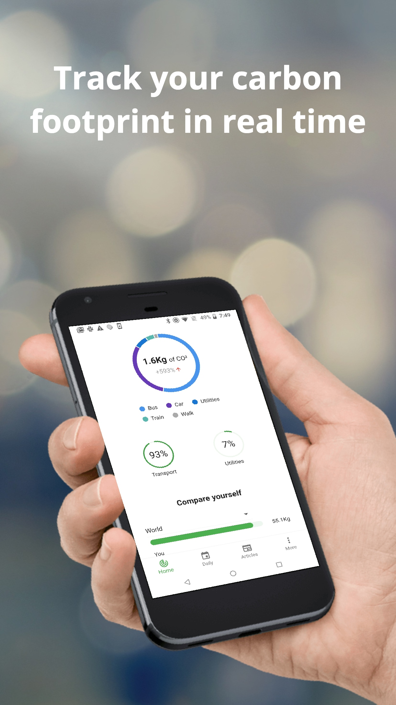
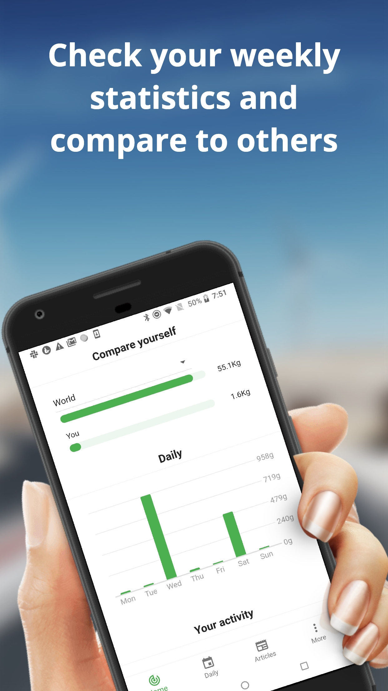
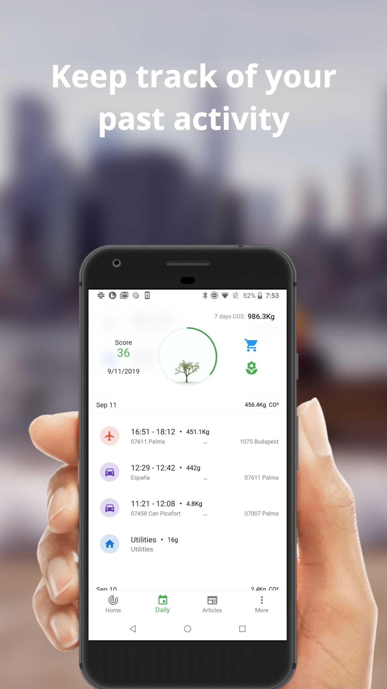
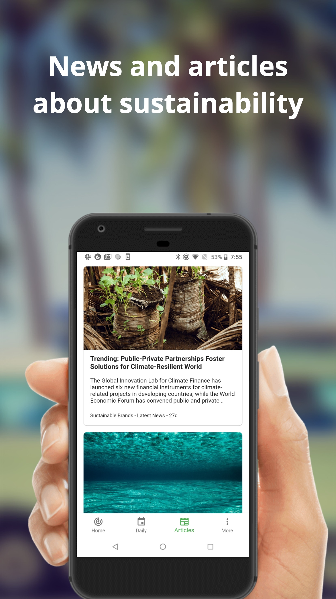
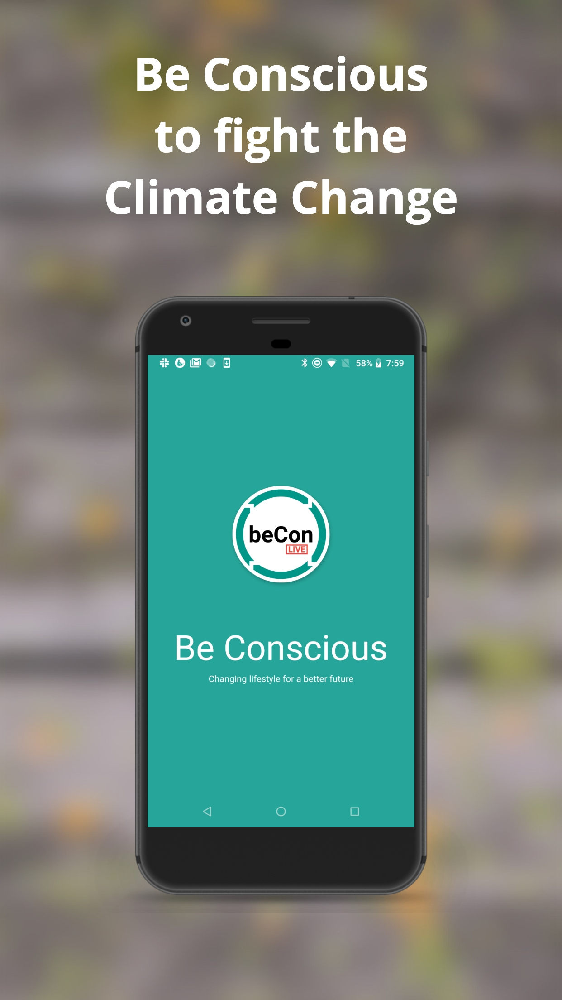

## Tell us what your idea is

beCon Live is a real-time carbon footprint tracker. The app presents in a timeline all the activity, statistics, news, tips, etc,. Users will be encouraged to decrease their carbon footprint.

We cover the 3 different sources of the carbon footprint:

###### Transportation

We use the device location to estimate it. Based on parameters like speed, distance, city, etc, the app predicts the type of transportation (car, bike, airplane,...) to estimate the carbon footprint. The user’s history is saved to improve future predictions.

###### Utilities

A quick onboarding questionnaire gives us information about the house size, heating system, air conditioning, etc. Later on we will offer the option to connect with smart meters

###### Merchandising

A barcode system will help us to calculate the carbon footprint. This can be used in 2 ways:

- At the supermarket, the user can compare products scanning their barcodes. The app will give information about the carbon footprint. This will allow the user to make better decisions based on quantity of carbon footprint, and not only on price.
- The supermarket will provide a new qrcode in the ticket with information about the purchased products. The total amount of carbon footprint will be added to the user profile

The user will have an option to neutralize the carbon footprint by **donations to carbon offsetting projects**.There is also a community-based feature: the users will be able to see their friends and family performance, and it will be possible to cover part of their footprint.

## Tell us how you plan on bringing it to life

The app is currently available in beta in Google Play and iOS App store. We are building it with Flutter.

In this phase we are focusing on the transportation carbon footprint. **We plan to incorporate machine learning to improve the transportation type detection**. We are currently collecting data about routes of users, consisting on start and end location, start and end time, transportation type (the user can choose between the most common transportation types). Also, we would like to add some other relevant parameters to the equation, like hour of the day, day of the week, weather, data from other sensors, etc.

The app already has a non-ML based mechanism to predict the transportation type. When the user gets a prediction, he/she can confirm it, if it’s correct, or fix it otherwise. We want to use this feedback to train our machine learning model.

We can use Google’s help in the following ways:

- Acquire machine learning skills and help in creating the ML model
- Provide visibility in Google Play to build a solid user base in order to train the ML model
- Technical support on firebase and flutter

###### Timeline

The app can already be used with the current non-ML based prediction system, and it is already published in the store, so our focus will be on the ML model implementation and training

- Present - January 31th: Focus on getting more users to collect the data we will use to trail the ML model
- February 1st - March 15th: ML model implementation.
- March 15th - April 23th: Beta version including ML predictor available for beta users group
- April 24 - May 1: Release of the new version

## More information

Link play store:

https://play.google.com/store/apps/details?id=live.becon.app

Screenshots:

|      |      |      |
| ---- | ---- | ---- |
|      |      |      |

## Other projects: The Mindfulness App - CTO

Firebase, android, iOS. Flutter

I have been working on this project for 3 years. I was hired to build the android app from scratch, and I also took responsibility of the backend side (Firebase). We have millions of downloads only on android

We are now in the process of rewriting the code for both mobile platforms with Flutter.